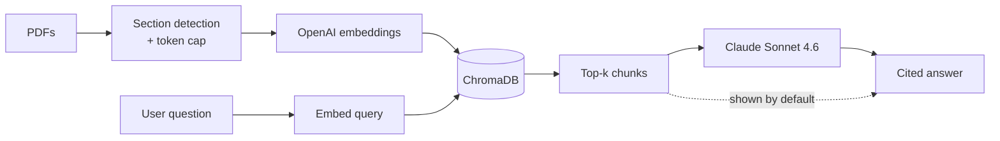

# 📚 Paperback — RAG Research Assistant

> **Citation-grounded Q&A over a personal corpus of ML papers. Answers cite the page; source chunks are visible by default — verifiable, not just plausible.**

---

## The problem

ML researchers add ~150 papers to their reading list per week. They forget what's in each one within a month. ChatGPT answers questions but invents page numbers and citations. Existing tools are either built for general docs (no grounding) or for discovery rather than deep recall over a corpus you've already chosen.

The unmet need: **a small, personal corpus + answers I can trust to be in a specific paper on a specific page.**

---

## The solution

Drop PDFs into the app. Each gets parsed by section, chunked (with a hard token cap), embedded, and stored in a local vector DB. Ask a question — the answer comes back with `[Paper Title, p.4]` citations and the *actual source text* shown below by default. Verifiable on every claim.

The whole UX bet: **the user should be reviewing the model's work, not trusting it.** Showing source chunks by default makes the product more, not less, trustworthy.

---

## Architecture



---

## Stack

- **PDF parsing:** `pdfplumber` with custom section detection + word-level reconstruction
- **Embeddings:** OpenAI `text-embedding-3-small` (1536-dim)
- **Vector DB:** ChromaDB (local persistent, cosine)
- **Generation:** Anthropic Claude Sonnet 4.6
- **UI:** Streamlit

---

## Read the PM work

- 📋 [**PRD**](./PRD.md) — problem, users, goals, success metrics, risks, roadmap
- 📝 [**Case study**](./case-study.md) — design tradeoffs, what I cut, what I'd ship next

---

## Run it

```bash
cd 01-research-assistant
python3 -m venv .venv && source .venv/bin/activate
pip install -r requirements.txt
streamlit run app.py
```

You need `OPENAI_API_KEY` and `ANTHROPIC_API_KEY` in a `.env` at the repo root.

---

## What's deliberately limited (v0.1)

- ~15% of papers fall back to fixed-token chunking when section detection fails on non-standard layouts
- No streaming responses (bottleneck is retrieval, not generation)
- Single user, single corpus
- No paper discovery / recommendations — this is for papers you've already chosen

These are documented honestly in the [PRD](./PRD.md) with the v0.2+ roadmap.

---

*Built by [Aafreen Fathima](https://github.com/aafreen-fathima) · May 2026. Two companion projects: [Signal](https://github.com/aafreen-fathima/signal) (interview agent) and [Audit](https://github.com/aafreen-fathima/audit) (LLM eval pipeline).*
